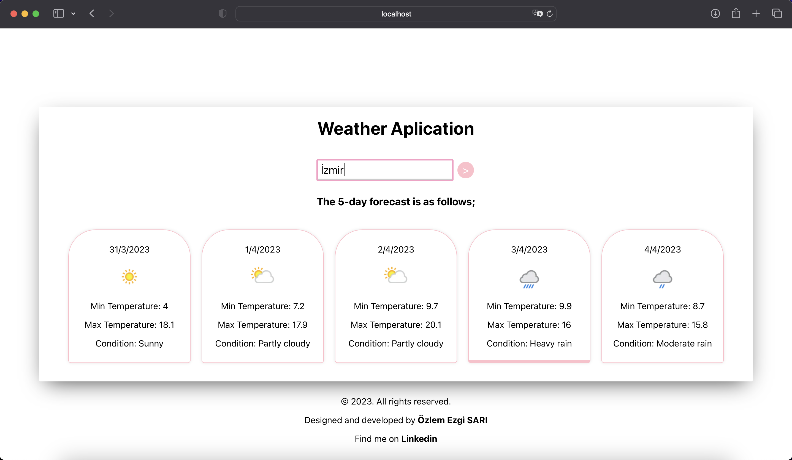

# Weather App

Bu uygulama, Weatherapi API'sini kullanarak hava durumu bilgilerini getirir ve kullanıcıya 5 günlük bir hava tahmini sunar. Uygulama, React ve CSS kullanılarak oluşturulmuştur.


## Özellikler ve Ekran Görüntüleri




- Kullanıcı, uygulama arayüzündeki arama kutusuna bir yer adı girerek istediği konumun hava tahmini bilgilerini alabilir
- Arayüz, seçilen yerin 5 günlük hava tahminlerini gösterir.
- Her güne ait minimum ve maksimum sıcaklık, hava durumu ikonu ve hava durumu durumu bilgisi görüntülenir.


## İsterseniz uygulamayı bilgisayarınızda çalıştırıp deneyimleyebilirsiniz.

Projeyi klonlayın ve gerekli paketleri yükleyin

```bash
  npm install
```
```bash
  npm install axios
```
[Weatherapi](https://www.weatherapi.com/) adresine kaydolup oluşturduğunuz API anahtarını main.js dosyasında bulunan API_KEY değişkeninde tanımlayabilirsiniz.

Son olarak sunucuyu çalıştırın.

```bash
  npm start
```

 ## Geri Bildirim

Proje ile alakalı herhangi bir öneri veya görüşünüz olursa lütfen benimle paylaşın.Profilimdeki linkedin adresinden bana ulaşabilirsiniz. 